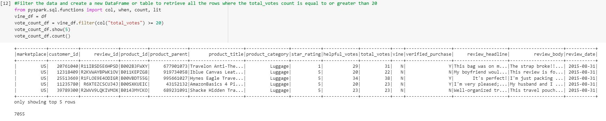
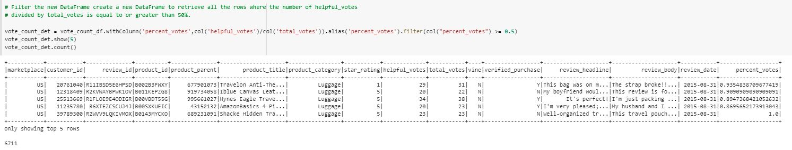
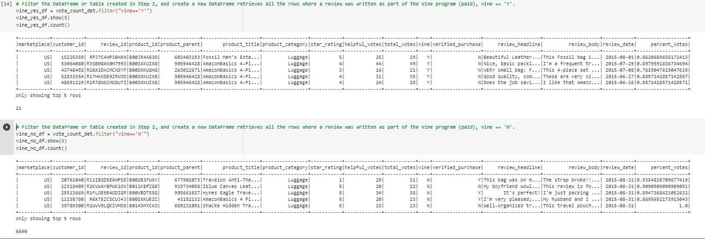
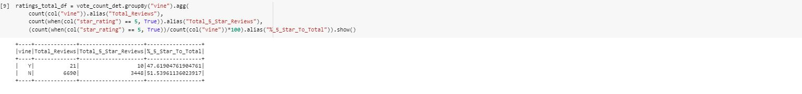

# 16Amazon_Vine_Analysis

## Project Overview

BigData and Jennifer have tasked us with an even BIGGER project, we will be analyzing the data compiled of a luggage reviews pulled from the Sellby website.  Sellby wants to understand how their reviews compare to the reviews of their competitors' products. 

An analysis was done of Amazon reviews comparing the reviews of Amazon Vine program subscribers to reviews from nonsubscribers, Sellby is interested in knowing if more favorable reviews came from paid Vine subscriptions versus reviews that were not a part of a paid Vine subscription. And it's our job to determine that answer for them!

 

## Results

- Total Number of Reviews Greater than 20: **7,055**

- Number of Helpful Votes Divided by the Total Votes Is Equal to or Greater than 50%: **6711**

- Analysis of Data Vine Subscriber vs. NonSubscriber
	- Vine Subscriber: **21**
	- Non-Vine Subscriber: **6,690**

- Total 5-Star Reviews: **3,458**
- Number of 5-Star Vine Reviews: **10**
- Number of 5-Star Non-Vine Reviews: **3,448**

	- Vine Review Percentage: **47.6%**
	- Non-Vine Review Percentage: **51.5%**

---

## Summary

After reviewing this data, Jennifer and I feel confident that we can go back to Sellby with solid answers regarding Amazon Vine's subscriber program. Analyzing this luggage data , it's clear there is no bias from paid subscribers.  By a landslide, nonsubscriber reviews were more prominently featured.

Our analysis shows a definite positivity bias towards *Nonsubscriber* reviews. For every Vine 5-star review, there were **300** Nonsubscriber reviews!  That's data to pay attention to, Sellby.

Pack your bags, Amazon Vine, your program isn't for everyone.
